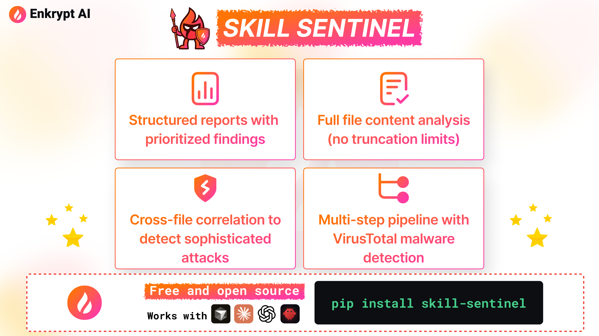

#  Enkrypt AI Skill Sentinel

A security scanner for Agent Skill packages. Skill Sentinel uses multi-agent AI analysis to detect prompt injection, data exfiltration, command injection, malware, and other threats hiding in skill packages for Cursor, Claude Code, Codex, and OpenClaw.

<div align="center">
  
</div>

Agent Skills extend AI coding assistants with custom instructions and scripts — but they also create a new attack surface. A single malicious skill can steal credentials, inject hidden prompts, exfiltrate code, or execute arbitrary commands. Skill Sentinel catches these threats before they reach your agent.

### Supported Platforms

<table>
  <tr>
    <td align="center" width="120"><br><b>Cursor</b></td>
    <td align="center" width="120"><br><b>Claude Code</b></td>
    <td align="center" width="120"><br><b>Codex</b></td>
    <td align="center" width="120"><br><b>OpenClaw</b></td>
    <td align="center" width="120"><i>and other agents</i></td>
  </tr>
</table>

## Key Features

### 🔍 Multi-Agent Security Pipeline

Specialized agents work together to analyze Skills from multiple angles — manifest inspection, file verification, cross-referencing, and threat correlation.

### 🦠 Built-in Malware Detection

Automatic VirusTotal integration scans binary files (executables, archives, PDFs) for known malware before any LLM analysis begins.

### 📄 No Truncation Limits

Reads complete file contents without arbitrary cutoffs — catching malicious instructions hidden deep in documentation where other scanners stop looking.

### 🔗 Cross-File Threat Correlation

Detects sophisticated attacks that span multiple files by tracking data flows and verifying that script behavior matches documented claims.

### 🎯 AI Agent Attack Detection

Purpose-built for prompt injection, command injection, credential theft, and other threats specific to AI coding assistants.

### ⚡ Parallel Bulk Scanning

Scan entire directories of Skills concurrently with organized reports — audit all your Cursor, Claude Code, Codex, and OpenClaw Skills in one command.

## Installation

Requires Python >= 3.10, < 3.14.

### Using uv (recommended)

```bash
uv venv --python 3.13 .venv
source .venv/bin/activate
uv pip install .
```

### Using pip

```bash
pip install .
```

For development (editable mode):

```bash
uv pip install -e .
# or
pip install -e .
```

## Quick Start

```bash
# 1. Export your OpenAI API key
export OPENAI_API_KEY="sk-..."

# 2. (Optional) Export your VirusTotal API key for binary malware scanning
export VIRUSTOTAL_API_KEY="your-vt-api-key"

# 3. Scan a skill directory
skill-sentinel scan /path/to/skill/directory
```

Alternatively, create a `.env` file in the project root instead of exporting variables:

```bash
cp .env.example .env
# Edit .env with your keys
```

## Usage

```
skill-sentinel scan [provider] [OPTIONS]

Positional:
  provider              cursor / claude / codex / openclaw to auto-discover that
                        provider's skills, or omit to discover all.
                        Can also be a direct path to a skill directory.

Path flags (mutually exclusive):
  --skill PATH          Scan a single skill directory.
  --dir PATH            Scan all skill subdirectories inside a parent directory.

Options:
  -o, --output PATH     Single scan: output file (default: report.json).
                        Multi-scan: output directory (default: ./skill_sentinel_reports).
  --parallel            Scan multiple skills in parallel (5 concurrent).
  -m, --model MODEL     OpenAI model to use (default: gpt-4.1).
  --api-key KEY         OpenAI API key (prefer OPENAI_API_KEY env var).
  -V, --version         Show version and exit.
```

### Examples

```bash
# Scan a single skill directory
skill-sentinel scan --skill ./my-skill
skill-sentinel scan --skill ./my-skill -o report.json

# Scan all skills inside a parent directory
skill-sentinel scan --dir ./all-my-skills/
skill-sentinel scan --dir ./all-my-skills/ -o ./reports/

# Scan in parallel (5 concurrent)
skill-sentinel scan --dir ./all-my-skills/ --parallel

# Auto-discover and scan ALL skills from cursor, claude, codex, and openclaw paths
skill-sentinel scan

# Auto-discover only Cursor skills, in parallel
skill-sentinel scan cursor --parallel

# Scan only Claude skills
skill-sentinel scan claude

# Custom output directory for auto-discovery
skill-sentinel scan codex -o ./my-reports/

# Use a different model
skill-sentinel scan --skill ./my-skill -m gpt-4o
```

### Auto-Discovery

When no path is given (or a provider keyword is used), the scanner searches these well-known locations for skill directories containing a `SKILL.md`:

| Location | Scope |
|---|---|
| `.cursor/skills/` | Project-level (Cursor) |
| `.claude/skills/` | Project-level (Claude) |
| `.codex/skills/` | Project-level (Codex) |
| `skills/` | Agent workspace-level (OpenClaw) |
| `~/.cursor/skills/` | User-level global (Cursor) |
| `~/.claude/skills/` | User-level global (Claude) |
| `~/.codex/skills/` | User-level global (Codex) |
| `~/.openclaw/skills/` | User-level global (OpenClaw) |

Reports are saved as `<provider>__<skill_name>.json` in `./skill_sentinel_reports/` (or the directory specified with `-o`).

### Programmatic Usage

```python
from skill_sentinel.main import scan

report = scan("/path/to/skill", output_path="report.json", model="gpt-4.1")
print(report["overall_risk_assessment"]["skill_verdict"])
```

## What It Does

The scanner performs a multi-step security analysis:

1. **File Discovery** — lists all files in the skill directory (static, no LLM).
2. **VirusTotal Binary Scan** *(optional)* — if binary files (executables, archives, images, PDFs, etc.) are found and a `VIRUSTOTAL_API_KEY` is set, each binary is checked against VirusTotal's malware database via SHA-256 hash lookup. Results are passed to the report synthesizer.
3. **SKILL.md Analysis** — an agent reads the SKILL.md manifest and instructions, looking for prompt injection, trust abuse, discovery abuse, and other threats.
4. **File Verification** *(conditional)* — if the skill contains scripts or referenced files beyond SKILL.md, a second agent reads each file and checks alignment with SKILL.md claims, searching for command injection, data exfiltration, hardcoded secrets, obfuscation, etc.
5. **Report Synthesis** — a final agent combines all findings (including VirusTotal results), filters false positives, prioritizes findings, and produces a structured JSON report.

### Malware Scanning (VirusTotal)

If a `VIRUSTOTAL_API_KEY` environment variable is set, Skill Sentinel automatically scans binary files found in skill packages against VirusTotal's malware database. This runs **before** the agent pipeline — no LLM calls are needed.

**Supported binary types:** executables (`.exe`, `.dll`, `.so`, `.dylib`, `.bin`), archives (`.zip`, `.tar`, `.gz`, `.7z`, `.rar`), documents (`.pdf`, `.doc`, `.xls`), images (`.png`, `.jpg`, `.gif`), JVM/WASM (`.jar`, `.war`, `.wasm`, `.class`), and more.

**Getting a free API key:** Sign up at [virustotal.com](https://www.virustotal.com/) — the free tier allows 500 lookups/day, which is more than enough for skill scanning.

## Output

The scanner writes a JSON report containing:

- `skill_path` — absolute path to the scanned skill directory
- `validated_findings` — confirmed threats with severity, evidence, remediation
- `false_positives` — dismissed findings with reasoning
- `priority_order` — ranked list of finding IDs
- `correlations` — related findings grouped together
- `recommendations` — actionable next steps
- `references` — VirusTotal scan links and other reference URLs
- `overall_risk_assessment` — risk level, verdict (SAFE / SUSPICIOUS / MALICIOUS), reasoning
- `token_usage` — LLM token usage metrics for the scan

## Project Structure

```
skill_scanner_package/
├── pyproject.toml              # Package build config
├── README.md
└── src/skill_sentinel/
    ├── __init__.py             # Package version
    ├── cli.py                  # CLI entry point
    ├── main.py                 # Programmatic API
    ├── crew.py                 # Multi-agent crew definition
    ├── config/
    │   ├── agents.yaml         # Agent definitions
    │   └── tasks.yaml          # Task definitions
    ├── data/
    │   ├── threat_categories.md    # Threat taxonomy
    │   └── report_schema.json      # Output JSON schema
    └── tools/
        ├── custom_tool.py      # ReadFile & Grep tools
        ├── file_discovery.py   # Static file listing
        └── virustotal_tool.py  # VirusTotal binary malware scanning
```

## Environment Variables

| Variable | Description | Default |
|---|---|---|
| `OPENAI_API_KEY` | Your OpenAI API key (required) | — |
| `OPENAI_MODEL_NAME` | Model to use for analysis | `gpt-4.1` |
| `VIRUSTOTAL_API_KEY` | VirusTotal API key for binary malware scanning (optional) | — |

## Threat Categories

Skill Sentinel detects the following threat categories, mapped to [OWASP Top 10 for LLM Applications 2025](https://genai.owasp.org/llm-top-10/) and [OWASP Top 10 for Agentic Applications](https://genai.owasp.org/agentic-top-10/):

| Category | Severity | Description |
|---|---|---|
| Prompt Injection | HIGH–CRITICAL | Override attempts, mode changes, policy bypass hidden in SKILL.md |
| Transitive Trust Abuse | HIGH | Instructions that delegate trust to external/untrusted data sources |
| Data Exfiltration | CRITICAL | Network calls that steal credentials, files, or environment variables |
| Command Injection | CRITICAL | Dangerous `eval()`, `exec()`, `os.system()`, shell injection |
| Hardcoded Secrets | CRITICAL | API keys, passwords, private keys embedded in code |
| Obfuscation | HIGH | Base64 blobs + exec, hex-encoded payloads, deliberately unreadable code |
| Unauthorized Tool Use | HIGH | Code that violates the skill's own `allowed-tools` declaration |
| Skill Discovery Abuse | HIGH | Brand impersonation, keyword baiting, misleading descriptions |
| Tool Chaining Abuse | HIGH | Multi-step workflows that read sensitive data then transmit it |
| Resource Abuse | MEDIUM | Infinite loops, unbounded memory allocation, recursive bombs |
| Autonomy Abuse | MEDIUM | Unsolicited activation, unbounded retries, no user confirmation |
| Over-Collection | MEDIUM | Disproportionate data access relative to stated purpose |
| Cross-Context Bridging | MEDIUM | Accessing data from other sessions, conversations, or workspaces |
| Dependency Risk | MEDIUM | Unpinned `pip install`, typosquatting, unknown GitHub repos |
| Malware | MEDIUM–CRITICAL | Binary files flagged by VirusTotal or unverifiable binaries |

## Contributing

Contributions are welcome! To get started:

1. Fork the repository
2. Create a feature branch (`git checkout -b feature/my-feature`)
3. Set up the development environment:

```bash
uv venv --python 3.13 .venv
source .venv/bin/activate
uv pip install -e .
```

4. Make your changes
5. Submit a pull request

## License

This project is licensed under the [Apache License 2.0](LICENSE).

Copyright 2025 [Enkrypt AI, Inc.](https://www.enkryptai.com/)
